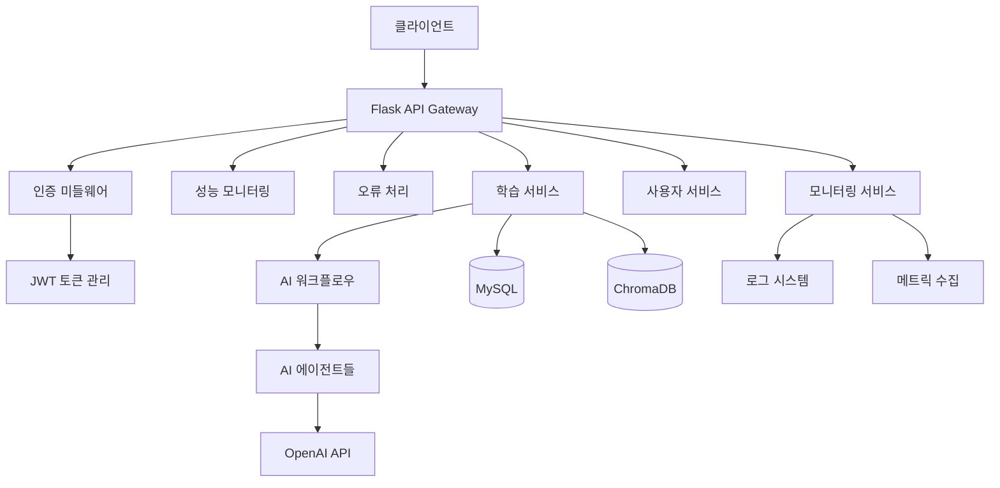

# AI Literacy Navigator - 기술 가이드

## 📋 목차

1. [아키텍처 개요](#아키텍처-개요)
2. [AI 워크플로우](#ai-워크플로우)
3. [성능 최적화](#성능-최적화)
4. [오류 처리 시스템](#오류-처리-시스템)
5. [모니터링 시스템](#모니터링-시스템)
6. [데이터베이스 설계](#데이터베이스-설계)
7. [보안 구현](#보안-구현)
8. [확장성 고려사항](#확장성-고려사항)

## 🏗️ 아키텍처 개요

### 시스템 구성도



### 레이어 구조

1. **프레젠테이션 레이어**: Flask Blueprint, API 엔드포인트
2. **비즈니스 로직 레이어**: Service 클래스들
3. **워크플로우 레이어**: LangGraph 기반 AI 워크플로우
4. **데이터 액세스 레이어**: SQLAlchemy 모델, ChromaDB
5. **인프라 레이어**: 로깅, 모니터링, 오류 처리

## 🤖 AI 워크플로우

### LangGraph 워크플로우 구조

```python
# workflow/graph_builder.py의 핵심 구조
class TutorWorkflow:
    def build_graph(self):
        workflow = StateGraph(TutorState)
        
        # 노드 추가
        workflow.add_node("tutor", self.tutor_node)
        workflow.add_node("quiz", self.quiz_node)
        workflow.add_node("feedback", self.feedback_node)
        
        # 조건부 엣지
        workflow.add_conditional_edges(
            "tutor",
            self.should_quiz,
            {
                "quiz": "quiz",
                "continue": "tutor",
                "end": END
            }
        )
        
        return workflow.compile()
```

### 상태 관리

```python
class TutorState(TypedDict):
    user_id: int
    chapter_id: int
    current_loop_id: str
    user_message: str
    system_response: str
    ui_mode: str
    ui_elements: Dict[str, Any]
    conversation_history: List[Dict[str, Any]]
    user_profile: Dict[str, Any]
    chapter_content: Dict[str, Any]
    recent_loops_summary: List[Dict[str, Any]]
    quiz_context: Dict[str, Any]
    feedback_context: Dict[str, Any]
```

### 에이전트 구현 패턴

```python
class BaseAgent:
    def __init__(self, name: str):
        self.name = name
        self.logger = LoggingConfig.get_contextual_logger(f'agent.{name}')
    
    @handle_errors(ErrorCategory.BUSINESS_LOGIC)
    @log_function_call('agent')
    def process(self, state: TutorState) -> TutorState:
        # 에이전트별 로직 구현
        pass
```

## ⚡ 성능 최적화

### 데이터베이스 최적화

#### 자동 인덱스 생성

```python
# services/performance_service.py
class DatabaseOptimizer:
    @staticmethod
    def create_indexes():
        indexes = [
            "CREATE INDEX IF NOT EXISTS idx_users_type_level ON USERS(user_type, user_level)",
            "CREATE INDEX IF NOT EXISTS idx_progress_user_status ON USER_LEARNING_PROGRESS(user_id, completion_status)",
            "CREATE INDEX IF NOT EXISTS idx_loops_user_chapter_status ON LEARNING_LOOPS(user_id, chapter_id, loop_status)",
            # ... 더 많은 인덱스
        ]
        
        for index_sql in indexes:
            db.session.execute(text(index_sql))
```

#### 쿼리 성능 모니터링

```python
@database_monitoring("get_user_progress")
def get_user_progress(user_id: int):
    # 쿼리 실행 시간 자동 측정
    return UserLearningProgress.query.filter_by(user_id=user_id).all()
```

### 메모리 최적화

#### State 크기 최적화

```python
class StateOptimizer:
    @staticmethod
    def optimize_tutor_state(state: Dict[str, Any]) -> Dict[str, Any]:
        optimized_state = state.copy()
        
        # 대화 기록 제한 (최대 50개)
        if 'current_loop_conversations' in optimized_state:
            conversations = optimized_state['current_loop_conversations']
            if len(conversations) > 50:
                optimized_state['current_loop_conversations'] = conversations[-50:]
        
        # 긴 메시지 압축
        StateOptimizer._compress_long_messages(optimized_state)
        
        return optimized_state
```

### API 성능 모니터링

```python
@performance_monitoring('POST /api/learning/send-message')
def send_message():
    # API 응답 시간 자동 측정
    # 느린 API 자동 감지 및 로깅
    pass
```

## 🚨 오류 처리 시스템

### 계층적 오류 처리

```python
# 커스텀 예외 계층
class CustomError(Exception):
    def __init__(self, message, error_code, category, severity, details):
        self.message = message
        self.error_code = error_code
        self.category = category  # DATABASE, AUTHENTICATION, etc.
        self.severity = severity  # LOW, MEDIUM, HIGH, CRITICAL
        self.details = details

class DatabaseError(CustomError):
    def __init__(self, message, **kwargs):
        super().__init__(message, category=ErrorCategory.DATABASE, **kwargs)

class AuthenticationError(CustomError):
    def __init__(self, message, **kwargs):
        super().__init__(message, category=ErrorCategory.AUTHENTICATION, **kwargs)
```

### 전역 오류 처리기

```python
class GlobalErrorHandler:
    def __init__(self, app: Flask):
        @app.errorhandler(Exception)
        def handle_general_exception(error):
            # 오류 추적
            self.error_tracker.track_error(error, context)
            
            # 복구 시도
            if self.recovery_manager.attempt_recovery(error, context):
                return success_response("문제가 해결되었습니다.")
            
            # 알림 전송
            self.error_notifier.notify_error(error, context)
            
            return error_response("서버 오류가 발생했습니다.", 500)
```

### 오류 복구 메커니즘

```python
class ErrorRecoveryManager:
    def register_recovery_strategy(self, error_type: type, strategy: Callable):
        self.recovery_strategies[error_type] = strategy
    
    def attempt_recovery(self, error: Exception, context: Dict[str, Any]) -> bool:
        error_type = type(error)
        if error_type in self.recovery_strategies:
            return self.recovery_strategies[error_type](error, context)
        return False

# 데이터베이스 연결 복구 전략
def database_recovery(error, context):
    try:
        db.session.rollback()
        db.session.close()
        db.session.execute("SELECT 1")
        return True
    except:
        return False
```

## 📊 모니터링 시스템

### 성능 메트릭 수집

```python
class PerformanceMonitor:
    def get_system_metrics(self) -> Dict[str, Any]:
        return {
            'timestamp': datetime.utcnow().isoformat(),
            'cpu_percent': psutil.cpu_percent(interval=1),
            'memory': {
                'total': memory.total,
                'available': memory.available,
                'percent': memory.percent
            },
            'disk': {
                'total': disk.total,
                'used': disk.used,
                'free': disk.free
            }
        }
    
    def get_database_metrics(self) -> Dict[str, Any]:
        return {
            'connection_pool': {
                'size': pool.size(),
                'checked_in': pool.checkedin(),
                'checked_out': pool.checkedout()
            },
            'table_counts': {
                'users': User.query.count(),
                'learning_loops': LearningLoop.query.count()
            },
            'slow_queries': self.get_slow_queries()
        }
```

### 구조화된 로깅

```python
class StructuredFormatter(logging.Formatter):
    def format(self, record):
        log_entry = {
            'timestamp': datetime.utcnow().isoformat() + 'Z',
            'level': record.levelname,
            'logger': record.name,
            'message': record.getMessage(),
            'module': record.module,
            'function': record.funcName,
            'line': record.lineno
        }
        
        # 요청 컨텍스트 정보 추가
        if has_request_context():
            log_entry.update({
                'request_id': getattr(g, 'request_id', None),
                'method': request.method,
                'path': request.path,
                'user_id': getattr(g, 'current_user_id', None)
            })
        
        return json.dumps(log_entry, ensure_ascii=False)
```

### 실시간 알림 시스템

```python
class ErrorNotifier:
    def notify_error(self, error: Exception, context: Dict[str, Any]):
        if isinstance(error, CustomError) and error.severity in [ErrorSeverity.HIGH, ErrorSeverity.CRITICAL]:
            error_info = {
                'timestamp': datetime.utcnow().isoformat(),
                'error_type': type(error).__name__,
                'message': str(error),
                'severity': error.severity,
                'context': context
            }
            
            # 이메일 알림 전송
            for handler in self.notification_handlers:
                handler(error_info)
```

## 🗄️ 데이터베이스 설계

### 핵심 테이블 관계

```sql
-- 사용자 테이블
CREATE TABLE USERS (
    user_id INT PRIMARY KEY AUTO_INCREMENT,
    username VARCHAR(50) UNIQUE NOT NULL,
    email VARCHAR(100) UNIQUE NOT NULL,
    password_hash VARCHAR(255) NOT NULL,
    user_type ENUM('beginner', 'business') NOT NULL,
    user_level ENUM('low', 'medium', 'high') NOT NULL,
    created_at DATETIME DEFAULT CURRENT_TIMESTAMP,
    INDEX idx_users_type_level (user_type, user_level),
    INDEX idx_users_active_created (is_active, created_at)
);

-- 학습 루프 테이블
CREATE TABLE LEARNING_LOOPS (
    loop_id VARCHAR(100) PRIMARY KEY,
    user_id INT NOT NULL,
    chapter_id INT NOT NULL,
    loop_sequence INT NOT NULL,
    loop_status ENUM('active', 'completed', 'abandoned') DEFAULT 'active',
    started_at DATETIME DEFAULT CURRENT_TIMESTAMP,
    completed_at DATETIME,
    FOREIGN KEY (user_id) REFERENCES USERS(user_id) ON DELETE CASCADE,
    UNIQUE KEY uk_user_chapter_sequence (user_id, chapter_id, loop_sequence),
    INDEX idx_loops_user_chapter_status (user_id, chapter_id, loop_status)
);
```

### 성능 최적화 인덱스

```sql
-- 복합 인덱스로 쿼리 성능 향상
CREATE INDEX idx_progress_user_status ON USER_LEARNING_PROGRESS(user_id, completion_status);
CREATE INDEX idx_conversations_loop_sequence ON CONVERSATIONS(loop_id, sequence_order);
CREATE INDEX idx_quiz_user_chapter ON QUIZ_ATTEMPTS(user_id, chapter_id);
```

## 🔐 보안 구현

### JWT 토큰 관리

```python
class JWTManager:
    @staticmethod
    def generate_token(user_id: int, user_type: str, user_level: str) -> str:
        payload = {
            'user_id': user_id,
            'user_type': user_type,
            'user_level': user_level,
            'iat': datetime.utcnow(),
            'exp': datetime.utcnow() + timedelta(seconds=Config.JWT_ACCESS_TOKEN_EXPIRES)
        }
        return jwt.encode(payload, Config.JWT_SECRET_KEY, algorithm='HS256')
    
    @staticmethod
    def verify_token(token: str) -> Optional[Dict[str, Any]]:
        try:
            payload = jwt.decode(token, Config.JWT_SECRET_KEY, algorithms=['HS256'])
            return payload
        except jwt.ExpiredSignatureError:
            return None
        except jwt.InvalidTokenError:
            return None
```

### 권한 기반 접근 제어

```python
def admin_required(f):
    @wraps(f)
    def decorated(*args, **kwargs):
        if not hasattr(g, 'current_user') or not g.current_user:
            return jsonify({'error': '인증이 필요합니다.'}), 401
        
        user_level = g.current_user.get('user_level')
        if user_level != 'high':
            return jsonify({'error': '관리자 권한이 필요합니다.'}), 403
        
        return f(*args, **kwargs)
    return decorated
```

### 요청 제한

```python
class RequestLimiter:
    def __init__(self, max_requests_per_minute: int = 60):
        self.max_requests = max_requests_per_minute
        self.requests = {}
    
    def is_allowed(self, client_ip: str) -> bool:
        current_time = time.time()
        minute_ago = current_time - 60
        
        # 1분 이전 기록 삭제
        if client_ip in self.requests:
            self.requests[client_ip] = [
                req_time for req_time in self.requests[client_ip] 
                if req_time > minute_ago
            ]
        
        # 요청 수 확인
        if len(self.requests.get(client_ip, [])) >= self.max_requests:
            return False
        
        # 현재 요청 기록
        self.requests.setdefault(client_ip, []).append(current_time)
        return True
```

## 📈 확장성 고려사항

### 수평적 확장

1. **상태 비저장 설계**: JWT 토큰 사용으로 세션 공유 불필요
2. **데이터베이스 연결 풀**: 다중 인스턴스 지원
3. **캐싱 레이어**: Redis 도입 가능

### 성능 확장

1. **비동기 처리**: Celery를 통한 백그라운드 작업
2. **CDN 활용**: 정적 콘텐츠 배포
3. **데이터베이스 샤딩**: 사용자별 데이터 분산

### 모니터링 확장

1. **메트릭 수집**: Prometheus + Grafana
2. **로그 집계**: ELK Stack 도입
3. **분산 추적**: Jaeger 또는 Zipkin

### 배포 전략

```yaml
# docker-compose.yml 예시
version: '3.8'
services:
  app:
    build: .
    ports:
      - "5000:5000"
    environment:
      - DATABASE_URL=mysql://user:pass@db:3306/ai_literacy
    depends_on:
      - db
      - redis
  
  db:
    image: mysql:8.0
    environment:
      MYSQL_DATABASE: ai_literacy_navigator
      MYSQL_ROOT_PASSWORD: rootpassword
    volumes:
      - mysql_data:/var/lib/mysql
  
  redis:
    image: redis:alpine
    ports:
      - "6379:6379"

volumes:
  mysql_data:
```

## 🔧 개발 도구 및 워크플로우

### 코드 품질 도구

```bash
# 코드 포맷팅
black .

# 린팅
flake8 .

# 타입 체킹
mypy .

# 보안 검사
bandit -r .
```

### 테스트 전략

```python
# 단위 테스트 예시
class TestAuthService(unittest.TestCase):
    def setUp(self):
        self.app = create_app()
        self.app_context = self.app.app_context()
        self.app_context.push()
    
    def test_register_user_success(self):
        result = AuthService.register_user(
            username="testuser",
            email="test@example.com",
            password="SecurePass123!",
            user_type="beginner"
        )
        self.assertTrue(result['success'])
    
    def tearDown(self):
        self.app_context.pop()
```

### CI/CD 파이프라인

```yaml
# .github/workflows/ci.yml
name: CI/CD Pipeline

on:
  push:
    branches: [ main, develop ]
  pull_request:
    branches: [ main ]

jobs:
  test:
    runs-on: ubuntu-latest
    steps:
    - uses: actions/checkout@v2
    - name: Set up Python
      uses: actions/setup-python@v2
      with:
        python-version: 3.9
    - name: Install dependencies
      run: |
        pip install -r requirements.txt
        pip install -r requirements-dev.txt
    - name: Run tests
      run: pytest
    - name: Run security checks
      run: bandit -r .
```

이 기술 가이드는 AI Literacy Navigator의 핵심 기술적 구현 사항들을 상세히 설명합니다. 개발자들이 시스템을 이해하고 확장하는 데 도움이 될 것입니다.